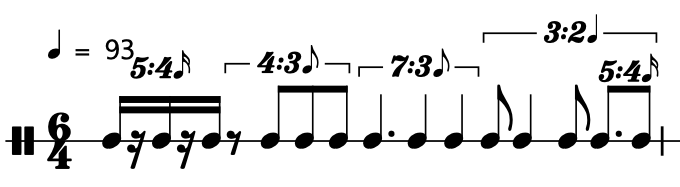

# TimeGrid

Ein ```TimeGrid``` dient dazu Daten in der Zeit zu quantisieren oder ein Menge von Zeitdaten zu generieren. Dies ist zuallererst mit den ```Grid```-Konstruktoren möglich.

## Vererbte Grid-Konstruktoren

Die implementierten vererbten Konstruktoren sind die direkte Erzeugung via *iterable*, ```.series()``` oder ```.interpolate()```. Die anderen Konstruktoren sind zur Zeit noch nicht vollständig implementiert und sollten nur mit Vorsicht verwendet werden.

### Direktes Initialiseren

Ein ```TimeGrid``` kann direkt mit Sekundenwerten initialisiert werden.

```python
from GreasyPidgin.TimeGrid import TimeGrid

t = TimeGrid([0,1,2,3,4.5], bpm = 111)
print(t)

##########  OUTPUT  ############################################################
#> TimeGrid
#>    sorted        = [0, 1, 2, 3, 4.5],
#>    durationSec   = 4.5,
#>    durationBeats = 8.325,
#>    BPM           = 111,
#>    size          = 5,
#>    layers:
```

### Lineare Konstruktion
Via ```.series(startTimeSec, stepSizeSec, size)```

```python
from GreasyPidgin.TimeGrid import TimeGrid

t = TimeGrid.series(1, 1, 10, bpm =111)
print(t)

##########  OUTPUT  ############################################################
#> TimeGrid
#>    sorted        = [1, 2, 3, 4, 5, 6, 7, 8, 9, 10],
#>    durationSec   = 10.0,
#>    durationBeats = 18.5,
#>    BPM           = 111,
#>    size          = 10,
#>    layers:
```

### Lineare Interpolation
Via ```.linearInterpolation(startTimeSec, endTimeSec, size)```

```python
from GreasyPidgin.TimeGrid import TimeGrid

t = TimeGrid.linearInterpolation(startTimeSec=0,endTimeSec= 2,size= 11, bpm =111)
print(t)

##########  OUTPUT  ############################################################
#> TimeGrid
#>    sorted        = [0.0, 0.2, 0.4, 0.6, 0.8, 1.0, 1.2, 1.4, 1.6, 1.8, 2.0],
#>    durationSec   = 2.0,
#>    durationBeats = 3.7,
#>    BPM           = 111,
#>    ticksPerBeat  = 480,
#>    size          = 11,
#>    layers:
```

### Nicht vollständig

```python
from GreasyPidgin.TimeGrid import TimeGrid

tr = TimeGrid.rand(10, 0, 10)
tg = TimeGrid.geom(1, 1.1, 10)
tf = TimeGrid.fib(10, 1, 2)
tl= TimeGrid.fill(10, lambda i: 2**i)
```

## Mikrotime-basierte Konstruktoren

Die zwei vorrangigen Arten ein ```TimeGrid``` zu erzeugen sind allerdings die Beat-bezogenen Methoden  ```.fromSubdivision()``` und ```.concatenateRQQEvents()```. Beide Methoden folgen der Idee, eine Makrozeit in eine Mikrozeit zu teilen.

### Multi-Mikrotime Teilung

Mit der Methode ```fromSubdivisions(subdivisions, durationBeats)``` kann eine vorab bestimmte Anzahl von Beats gleichzeitig in mehrere Untereinheiten unterteilt werden. Für jede Unterteilung wird der Resultierende Wert in ein separates ```layer``` geschrieben, als auch dem ```TimeGrid``` selbst beigefügt. Dauern und Endpunkte, sowohl in Sekunden als auch Beats, werden automatisch berechnet. 

```python
from GreasyPidgin.TimeGrid import TimeGrid

t = TimeGrid.fromSubdivisions(subdivisions=[3,4], durationBeats=10)
print(t)

##########  OUTPUT  ############################################################
#> TimeGrid
#>    sorted        = [0.0, 0.25, 0.333333, 0.5, 0.666667, 0.75, 1.0, 1.25, 1.333333, 1.5, 1.666667, 1.75],
#>    durationSec   = 1.75,
#>    durationBeats = 1.75,
#>    BPM           = 60.0,
#>    ticksPerBeat  = 480,
#>    size          = 12,
#>    layers:
#>       / 3 : [0.0, 0.333333, 0.666667, 1.0] ...
#>       / 4 : [0.0, 0.25, 1.0, 0.5] ... 
```

### RQQ Teilung

```RQQ``` ist eine Rhythmus-Notation, die von William "Bill" Gardner Schottstaedt als Teil von *Patchwork / OpenMusic* entwicklet wurde.[^1] Die Idee hinter ```RQQ``` ist, dass eine beliebig verschachtelte Rhythmusstruktur mittels simpler Proportionen abgebildet werden kann. In dieser Python-Implementation kann ein ```RQQ```-Objekt entweder alleinstehend verwendet werden oder als Konstruktor für ein ```TimeGrid```.

Nehmen wir an, eine 4telnote entspricht einem Beat, so können wir eine 8eltriole wie folgt darstellen:

```python
from GreasyPidgin.TimeGrid import RQQ

print(RQQ(1, [1,1,1]))

##########  OUTPUT  ############################################################
#> RQQ
#>   durationBeats    : 1
#>   subdivisions     : [1, 1, 1]
#>   bpm              : 81.0
#>   startOffsetBeats : 0.0
#>   startsBeats      : [0.0, 0.3333333333333333, 0.6666666666666666]
```

Mittel des ```Rest```-Objekts[^2] können Pausen hinzugefügt werden. Eine 4telnote gefolgt von einer 8elpause und ein 8elnote sieht wie folgt aus:

```python
from GreasyPidgin.TimeGrid import RQQ,R, Rest

print(RQQ(2, [2,Rest(1),1]))
print("Rest == R: ",Rest(1) == R(1))
##########  OUTPUT  ############################################################
#> RQQ
#>   durationBeats    : 2
#>   subdivisions     : [2, 1.0, 1]
#>   bpm              : 60.0
#>   startOffsetBeats : 0.0
#>   startsBeats      : [0.0, 1.5]
#
#> Rest == R:  True
```

So können nun beliebig komplizierte Verästelungen geschrieben werden. 
```python
from GreasyPidgin.TimeGrid import RQQ, R, TimeGrid

rqq = RQQ(6,[
    RQQ(1, [1,R(1),1,R(1),1]),
    RQQ(1.5, [R(1),1,1,1]),
    RQQ(1.5, [3,2,2]),
    RQQ(2, [
        RQQ(2,[1,2,1]),
        RQQ(1, [3,2])
        ])
    ])

t = TimeGrid.fromRQQ(rqq, bpm = 93)
print(t)
t.parseMidi()
```



## Midi-Export

Wie im vorigen Beispiel bereits durchgeührt, kann mit der Methode ```.parseMidi()``` das Grid, sowie alle Layer als Multi-Track Midifile exportiert werden.

[^1]: Originalquellen: http://recherche.ircam.fr/equipes/repmus/PatchWork/ , https://github.com/openmusic-project; Implementation von Michael Edwards in ```slippery ckicken```: https://michael-edwards.org/sc/manual/rhythms.html#tuplets 

[^2]: Als Kurzschreibweise ist auch ```R``` möglich