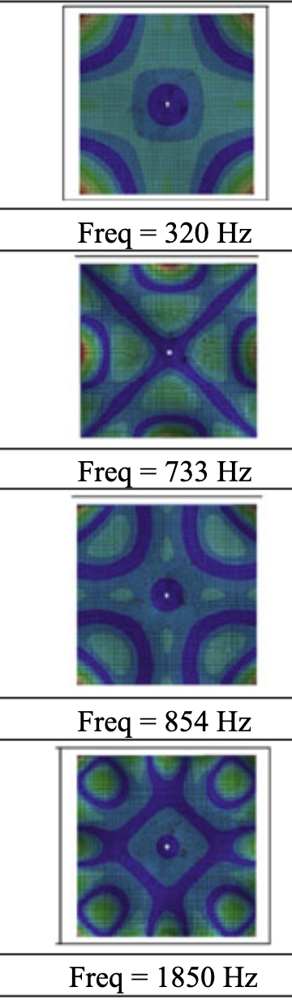
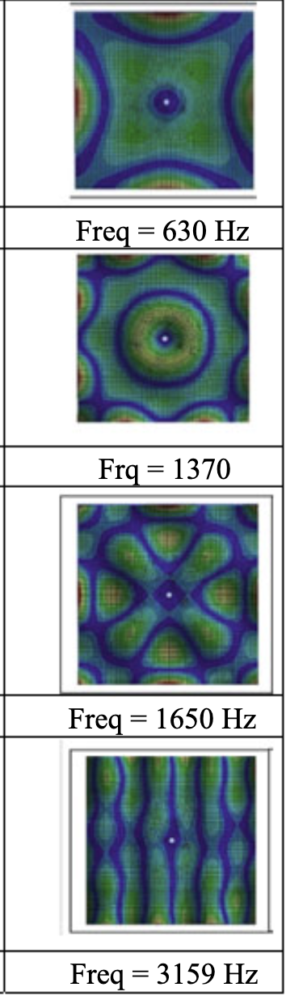

# Gesture

## Was ist eine Gesture?

Eine ```Gesture``` ist eine *Klanggeste* - die kleinste beschreib- und reduzierbare Gruppierung mehrerer *Klangpartikel*. Der Komplexität sind dabei allerdings keine Grenzen gesetzt.


## Eine Gesture erzeugen

### Sekunden oder Beats
Ein ```Phonon``` muss wie ein ```TemporalObject``` immer mit einer Startzeit und einer Dauer initialisiert werden. Dabei ist es in einem jetzt musikalischen Kontext möglich die Zeit entweder in ```'seconds'``` / ``` 's'``` (default) oder ```'beats'``` / ```'b'``` zu setzten.

```python
from GreasyPidgin.Phonon import Phonon

ps = Phonon(1,duration = 10,timeUnit='s')
pb = Phonon(1,duration = 10,timeUnit='b', bpm = 161)

print(ps)
print(pb)

##########  OUTPUT  ############################################################
# Phonon(
#    id          : 1
#    startSec    : 1.000, durSec: 10.000, endSec: 11.000
#    pitchesMidi :
#          - all         : {0}
#          - highest     : [0]
#          - lowest      : [0]
#          - mostCommon  : [0.0]
#          - leastCommon : [0.0]

# [0]
# Phonon(
#    id          : 2
#    startSec    : 0.373, durSec: 3.727, endSec: 4.099
#    pitchesMidi :
#          - all         : {0}
#          - highest     : [0]
#          - lowest      : [0]
#          - mostCommon  : [0.0]
#          - leastCommon : [0.0]
```

### Tonhöhe
Die essentielle Erweiterung ist nun, dass Tonhöhen ergänzt werden können. Die Tonhöhen selbst könnnen dabei entweder als ```'midi'```, ```'hz'``` oder ```'spn'```[^1] formatiert sein.

```python
from GreasyPidgin.Phonon import Phonon

pSingleMidi = Phonon(1,1,pitch=68)
pMidiMicro = Phonon(1,1,pitch=68.45)

pFromSPN = Phonon(1,4,'af4', pitchUnit = 'spn')

pFromFreq = Phonon(1,2, 440, pitchUnit='hz')

if type(pSingleMidi) == Phonon and type(pMidiMicro) == Phonon:
    print("This is 'True' because pitchUnit='midi' is the default")

print("The midipitch for pFromSPN is: ",pFromSPN.allPitches[0])

print("The midipitch for pFromFreq is: ",pFromFreq.allPitches[0])

##########  OUTPUT  ############################################################
# This is 'True' because pitchUnit='midi' is the default
# The midipitch for pFromSPN is:  68.0
# The midipitch for pFromFreq is:  69.0

```
### Tonhöhenstruktur
Ein ```Phonon``` kann drei verschiedenen Tonhöhenstrukturn nutzen:

- *```'seq'``` / ```'s'```*: Eine monophone Sequenz von Tonhöhen, inkl. des Spezialfalls Sequenzlänge 1 für nur eine Tonhöhe => *default*. In dieser Version muss die Abfolge von Tonhöhen in gleichen Abständen erfolgen.

    ```python
    from GreasyPidgin.Phonon import Phonon

    pSingle = Phonon(1,1,pitch='af4',pitchUnit='spn',)
    pList = Phonon(1,1,pitch=['af4'],pitchUnit='spn',)
    print(pSingle.allPitches == pList.allPitches, ", because both Phonons are a one-element 'seq' by default")

    pSeq = Phonon(1,1,pitch=['af4', 'b4', 'bf4', 'b4'],pitchUnit='spn',)
    print(pSeq)

    ##########  OUTPUT  ############################################################
    # True , because both Phonons are a one-element 'seq' by default
    # Phonon(
    #    id          : 2
    #    startSec    : 1.000, durSec: 1.000, endSec: 2.000
    #    pitchesMidi :
    #          - all         : [68.0, 70.0, 71.0]
    #          - highest     : [71.0]
    #          - lowest      : [68.0]
    #          - mostCommon  : [71.0]
    #          - leastCommon : [70.0]
    ```

- ```'chord'``` / ```'c'```: Ein einzelner Akkord bzw ein einzelnes komplexes Spektrum[^2].

    ```python
    from GreasyPidgin.Phonon import Phonon

    pChladniSpectrum = Phonon(
        2,10, 
        [320, 630, 733, 854, 1370, 1650, 1850, 3159],
        pitchUnit='hz',
        chordOrSeq='chord')

    print(pChladniSpectrum)

    ##########  OUTPUT  ############################################################
    # Phonon(
    #    id          : 0
    #    startSec    : 2.000, durSec: 10.000, endSec: 12.000
    #    pitchesMidi :
    #          - all         : [63.486820576352436, 75.21417965835143, 77.83571609530983, 80.48079055314997, 88.66320557187876, 91.88268714730222, 93.86339810254819, 103.12671009866656]
    #          - highest     : [103.12671009866656]
    #          - lowest      : [63.486820576352436]
    #          - mostCommon  : [63.486821]
    #          - leastCommon : [103.12671]


:::{figure}
:class: grid grid-cols-2 items-end gap-4:
:align: center
<div style="height: 600px; display: flex; align-items: center;">


</div>

:::
- ```'chordSeq'``` / ```'cs'```: Eine Akkordsequenz oder ein sich modulierendes Spektrum. Wie bei der einfach ```seq``` wird auch hier angenommen, dass die zeitlichen Abstände zwischen den einzelnen Akkorden identisch sind. Grundeinstellung ist, dass die einzelnen Akkorde via ```autoSortChords = True``` vom tiefstem zum höchsten Ton sortiert werden.

    ```python
    from random import randint
    from numpy import clip

    from GreasyPidgin.Phonon import Phonon
    from GreasyPidgin.Pitch import spntof

    stages = [[randint(200, 400) for _ in range(30)]]
    for _ in range(8):
        newStage = [int(clip(f+randint(-20, 20), 200, 400)) for f in stages[-1]]
        stages.append(newStage)
    finalChordSPN = [
        'd1','d1','d2','d2','d3','d3','d3',
        'a2','a2',
        'd4','d4','dtf4','dts4', 'd5','d5','dtf5','dts5','d6','d6','dtf6','dts6',
        'a4','atf4', 'ats4','a5','atf5', 'ats5',
        'fs5','fstf5', 'fsts5']
    stages.append([spntof(f) for f in finalChordSPN])

    thxLogoTheme = Phonon(0, 29, stages, pitchUnit='hz', chordOrSeq='chordSeq')
    print(thxLogoTheme)

    # thxLogoTheme.parseMidi(noteSelectKey='chordSeq') # more on this later!

    ##########  OUTPUT  ############################################################
    # Phonon(
    #    id          : 0
    #    startSec    : 0.000, durSec: 29.000, endSec: 29.000
    #    pitchesMidi :
    #          - all         : [26.0, 38.0, ... ]
    #          - mostCommon  : [67.349958]
    #          - leastCommon : [78.166667]
    ```
    ```{image} IMG/moorer_thx.png
    :alt: Original Handschrift von James A. Moorer für das "THX LOGO THEME"
    :width: 650px
    :align: center
    ```

## Export

Bisher ist, wie für das ```TemporalObject```, nur der Export als ```MIDI-Datei``` möglich.

### Midi

Mit der Methode ```.parseMidi(folder, trackname, perNoteTracks, noteSelectKey)``` kann ein ```Phonon``` als ```MIDI-Datei``` exportiert werden. Dabei gibt es verschiedenen Möglichkeiten, die Komplexität eines ```Phonon``` abzubilden. Als Standardeinstellung wird mit dem Parameter ```noteSelectKey = 'lowest'``` immer der tiefste vorhandene monophone Midiwert zum Export genutzt:

```python
from GreasyPidgin.Phonon import Phonon
p = Phonon(0, 10, [['af4','a4'],['af4','gqs4'],['af4','a4']], chordOrSeq='cs',pitchUnit='spn')
p.parseMidi('/tmp/default_is_')
print('\n\n')
p.parseMidi()

##########  OUTPUT  ############################################################
# Transformed pitch(es) to:
#     TemporalObject(id=0, start=0.000, dur=10.000, end=10.000, dyn=100.0 dB, pitch=67.5, bpm=60.0, track=0)

# Midi file saved to:  /tmp/default_is_lowest.mid
# Particle:  0  saved to  /tmp/default_is_lowest.mid


# Transformed pitch(es) to:
#     TemporalObject(id=1, start=0.000, dur=10.000, end=10.000, dyn=100.0 dB, pitch=67.5, bpm=60.0, track=0)

# Midi file saved to:  /tmp/lowest.mid
# Particle:  0  saved to  /tmp/lowest.mid

```

#### Optionen für ```noteSelectKey```

Die weiteren Optionen sind: ```'highest'``` , ```'mostCommon'``` , ```'leastCommon'``` ,  ```'all'``` , ```'allSet'``` / ```'chord'``` , ```'seq'``` und ```'chordSeq'```.

- ```'highest'```: Die höchste Note aus allen enthaltenen Midiwerten.
- ```'mostCommon'```: Die häufigste Note aus allen enthaltenen Midiwerten.
- ```'leastCommon'```: Die seltenste Note aus allen enthaltenen Midiwerten.
- ```'all'```: Alle Noten als Blockakkord, inkl Dopplungen.
- ```'allSet'``` / ```'chord'```: Alle Noten als Blockakkord, aber ohne Dopplungen.
- ```'seq'```: Ideal für homophone Tonhöhen-Bewegungen. Bei akkordischen Sequenzen wird Unterstimme ausgegeben. Alternativ kann beim initialisieren mit ```autoSortChords = False``` die erste erzeugte Sequenz exportiert werden.
- ```'chordSeq'```: Alle Akkorde einer Sequenz, die Akkorde sind per se frei von Stimmkreuzungen. Um diese zu erlauben, muss beim initialisieren ```autoSortChords = False``` gesetzt werden.


Beispiel für eine Sequenz:
```python
from GreasyPidgin.Phonon import Phonon
p = Phonon(
    0, 10, 
    pitch=['af4','a4','a4','gqs4','af4','a4'],
    chordOrSeq='s',pitchUnit='spn')

p.parseMidi(noteSelectKey='seq')
p.parseMidi(noteSelectKey='chordSeq')
p.parseMidi(noteSelectKey='lowest')
p.parseMidi(noteSelectKey='highest')
p.parseMidi(noteSelectKey='mostCommon')
p.parseMidi(noteSelectKey='leastCommon')
p.parseMidi(noteSelectKey='allSet')
p.parseMidi(noteSelectKey='chord')
```

Beispiel für Akkordsequenzen:
```python
from GreasyPidgin.Phonon import Phonon
p = Phonon(
    0, 10, 
    pitch=[['af4','a4'],['a4','gqs4'],['af4','a4']],
    chordOrSeq='cs',pitchUnit='spn')

for noteSelectKey in ['seq','chordSeq','lowest','highest','mostCommon','leastCommon','allSet','chord']:
    p.parseMidi(noteSelectKey=noteSelectKey)
```

Beispiel für einen Akkord:
```python
from GreasyPidgin.Phonon import Phonon
p = Phonon(
    0, 10, 
    pitch=['af4','a4','a4','gqs4','af4','a4'],
    chordOrSeq='c',pitchUnit='spn')

for noteSelectKey in [
    'seq','chordSeq','lowest','highest',
    'mostCommon','leastCommon','allSet','chord'
    ]:
    p.parseMidi(noteSelectKey=noteSelectKey)
```


[^1]: *scientific pitch notation*, siehe ```Pitch.py```,  ```02_Pitch.md``` oder **Kapitel 2: Pitch**
[^2]: Bespiel-Spektrum entnommen aus: https://www.researchgate.net/publication/380052462_Chladni_Plate_and_Chladni_Patterns-A_Research_Review_of_Theory_Modelling_Simulation_and_Engineering_Applications